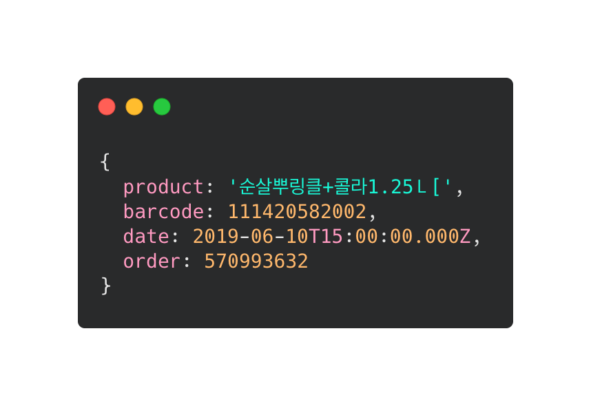

# kakao-gift-ocr
[](https://www.npmjs.org/package/kakao-gift-ocr)


[](https://nodei.co/npm/kakao-gift-ocr/)

OCR library for parsing data in Kakao Gift Cards

 

## 📦 Installation

```bash
npm install kakao-gift-ocr
# Or using yarn
yarn add kakao-gift-ocr
```

## 🔥 Action

```typescript
import KakaoGiftOCR from 'kakao-gift-ocr';
const fs = require('fs');

const ignoreLogs = () => {};

(async () => {
  const giftCardParser = new KakaoGiftOCR(ignoreLogs);
  await giftCardParser.Ready;

  const chickenGiftCard = fs.readFileSync('./test/chicken.jpeg');
  const giftCard = await giftCardParser.getInfo(chickenGiftCard);

  console.log(giftCard);
  // {
  //   name: '순살뿌링클+콜라1.25Ｌ[',
  //   barcode: 111420582002,
  //   dueDate: 2019-06-10T15:00:00.000Z,
  //   order: 570993632
  // }

  await giftCardParser.terminate();
})();
```
